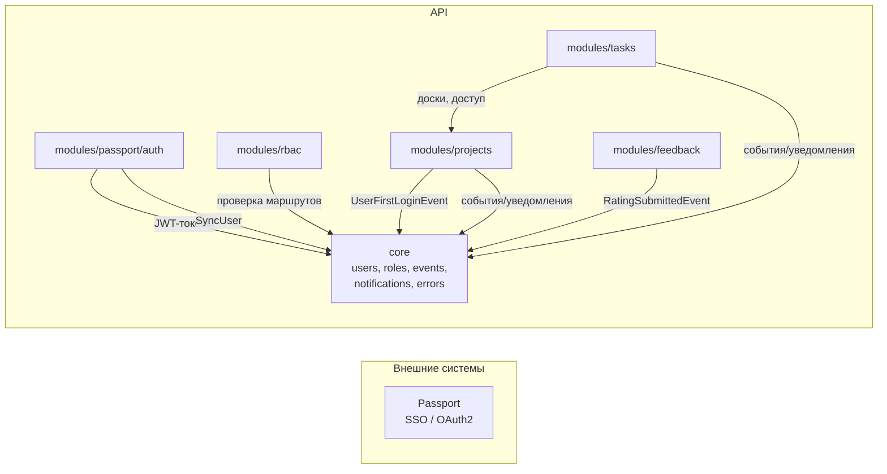

# Возможности системы TASKFLOW CRM

> Этот документ описывает функциональные возможности системы на уровне бизнес-логики: что умеет система, какие есть модули, как они связаны. Технические детали — в разделах `core/` и `modules/`.

TASKFLOW CRM — система управления задачами и проектами для креативных агентств и личного использования. Построена на принципах DDD и Clean Architecture. API — RESTful, JSON.

---

## Сводная таблица возможностей

| Область | Возможность | Модуль | Статус |
|---|---|---|---|
| Аутентификация | SSO-вход через внешний сервис Passport | passport/auth | ✅ |
| Аутентификация | Автоматический refresh токенов | passport/auth | ✅ |
| Аутентификация | Выход (proxy на Passport) | passport/auth | ✅ |
| Авторизация | Роли пользователей (user, admin) | core + rbac | ✅ |
| Авторизация | Разрешения (permissions) с wildcard-соответствием | rbac | ✅ |
| Авторизация | Контроль доступа к маршрутам (RBAC middleware) | rbac | ✅ |
| Пользователи | Синхронизация локальных пользователей с Passport | core | ✅ |
| Проекты | Создание/редактирование/удаление проектов | projects | ✅ |
| Проекты | Типы проектов (личный, командный…) | projects | ✅ |
| Проекты | Участники проекта и роли внутри проекта | projects | ✅ |
| Проекты | Приглашения по email и их принятие/отмена | projects | ✅ |
| Проекты | Автосоздание личного проекта при первом входе | projects | ✅ |
| Доски | Канбан-доски внутри проектов | projects + tasks | ✅ |
| Доски | Колонки досок с сортировкой (reorder) | tasks | ✅ |
| Задачи | Создание, редактирование, удаление задач | tasks | ✅ |
| Задачи | Мягкое удаление (soft delete) и восстановление | tasks | ✅ |
| Задачи | Жёсткое удаление (hard delete) | tasks | ✅ |
| Задачи | Назначение исполнителя (assign) | tasks | ✅ |
| Задачи | Перенос между колонками канбана | tasks | ✅ |
| Задачи | Вложенные задачи (parent_id) | tasks | ✅ |
| Задачи | Приоритеты задач | tasks | ✅ |
| Задачи | Дедлайны и признак просроченности | tasks | ✅ |
| Задачи | Комментарии к задачам | tasks | ✅ |
| Задачи | Стикеры/теги и привязка к задачам | tasks | ✅ |
| Тайм-трекинг | Таймеры (старт/стоп) | tasks | ✅ |
| Тайм-трекинг | Ручное логирование интервалов | tasks | ✅ |
| Тайм-трекинг | Планируемое время (planned fields) | tasks | ✅ |
| Тайм-трекинг | Дневная сводка (daily summary) | tasks | ✅ |
| Тайм-трекинг | Сводка времени по задаче | tasks | ✅ |
| Тайм-трекинг | Диаграмма занятости пользователя (busy chart) | tasks | ✅ |
| Тайм-трекинг | Автостарт таймера при назначении/переносе | tasks | ✅ |
| Уведомления | Email-уведомления (приглашения, обратная связь) | core + задачи | ✅ |
| Уведомления | Push/Telegram-каналы (каркас) | core | 🚧 каркас |
| Обратная связь | Оценка сервиса (4 критерия 0–5) | feedback | ✅ |
| Обратная связь | Идеи по улучшению | feedback | ✅ |
| Обратная связь | Статистика оценок | feedback | ✅ |
| Обратная связь | Email при не максимальной оценке | feedback | ✅ |
| Документация | Swagger/OpenAPI + Markdown-доки в вебе | core | ✅ |

> 🚧 — реализован каркас, полная интеграция в планах (см. [known-issues-and-roadmap](./known-issues-and-roadmap.md)).

---

## Ключевые пользовательские сценарии

### 1. Вход в систему (SSO)
1. Пользователь открывает фронтенд и нажимает «Войти».
2. Фронтенд редиректит на `GET /auth/login` API.
3. API создаёт `state` (случайная строка, кука `taskflow_oauth_state` на 10 минут) и редиректит на Passport `/auth/authorize`.
4. Пользователь входит на Passport, Passport редиректит обратно на `GET /auth/callback?code=...&state=...`.
5. API меняет `code` на пару токенов (access + refresh), кладёт их в httpOnly-куки и редиректит на фронтенд.
6. При первом входе создаётся личный проект пользователя.

### 2. Работа с задачами на канбан-доске
1. Пользователь открывает проект → видит доску с колонками.
2. При переносе задачи в другую колонку вызывается `POST task/<id>/move-to-column`.
3. Задача может быть назначена исполнителю (`POST task/<id>/assign`).
4. Если колонка/назначение меняются — система может автоматически запустить таймер учета времени.

### 3. Учёт рабочего времени
1. Пользователь запускает таймер (`POST time-interval/start`), останавливает (`POST time-interval/stop`).
2. Можно добавить интервал вручную (`POST time-interval`).
3. Система ведёт daily summary и считает время по задачам; строит диаграмму занятости пользователя.

### 4. Приглашение участника в проект
1. Владелец проекта вызывает `POST project/<id>/invite` с email.
2. Система создаёт приглашение и отправляет email.
3. Пользователь переходит по ссылке, вызывает `POST invitation/accept` — становится участником.
4. Приглашение можно отменить (`DELETE project/<id>/invitation`).

### 5. Обратная связь
1. Пользователь ставит оценку (скорость, функциональность, дизайн, удобство) — `POST feedback/rating`.
2. Если оценка не максимальная — на email приходит письмо с просьбой рассказать о проблемах.
3. Пользователь может отправить идею — `POST feedback/idea`.

---

## Модули и их взаимодействие

Ключевые точки интеграции:

- **passport/auth → core**: `SyncUserHandler` создаёт/обновляет локального пользователя по данным Passport.
- **rbac → core**: `RbacMiddleware` использует `YiiIdentity` и разрешения; middleware вызывается глобально через `beforeRequest`.
- **projects → core**: слушатель `CreatePersonalProjectOnUserFirstLogin` подписан на глобальное событие `UserFirstLoginEvent`.
- **tasks → projects**: `TaskAccess` и `ITaskAccess` делегируют проверку прав на доску в `IProjectAccess` (проекты владеют досками).
- **feedback → core**: слушатель `SendNonMaxRatingEmailListener` подписан на `RatingSubmittedEvent` и шлёт письма через `NotificationHub`.

Подробности взаимодействия — в [диаграммах](./.diagrams/request-pipeline-sequence-diagram.puml) и документации каждого модуля.

---

## Форматы ответов API (кратко)

Все ответы имеют единую структуру (подробно: [фронтенд-гид](./frontend-guide.md)):

| Обёртка | Формат |
|---|---|
| Один объект | `{ "item": { ... } }` |
| Список | `{ "items": [ ... ], "_meta": { "total", "page", "limit", "pages" } }` |
| Успех без данных | `{ "message": "OK" }` |
| Ошибка | `{ "error": { "code", "message", "details" } }` |