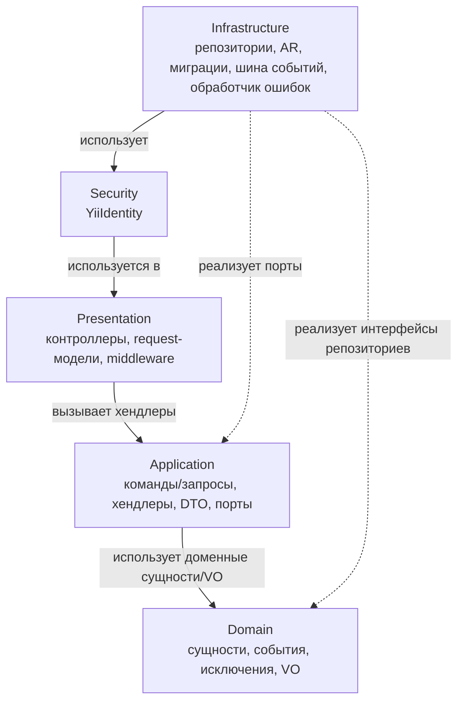
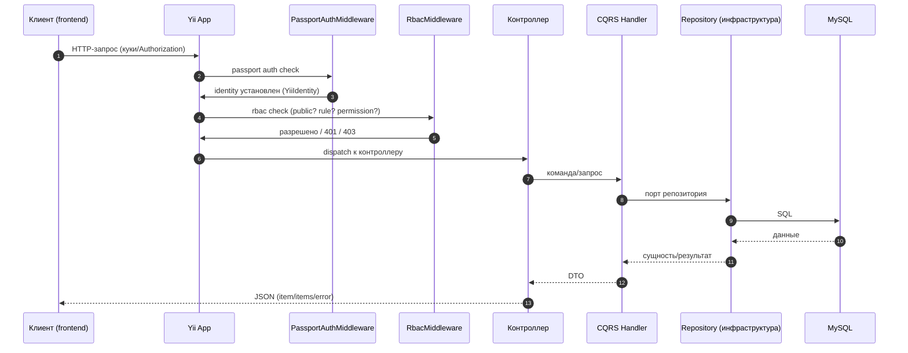
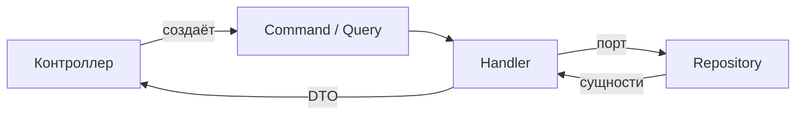

# Архитектура ядра: слои, DDD, Clean Architecture, CQRS

> Документ описывает архитектурные принципы ядра `core/` и взаимодействие слоёв, а также общий поток запроса через ядро и модули.

## 1. Принципы

Проект построен на трёх взаимосвязанных подходах:

1. **DDD (Domain-Driven Design)** — бизнес-логика сосредоточена в доменных сущностях и value objects; модули = bounded contexts.
2. **Clean Architecture** — зависимости направлены внутрь: `presentation → application → domain`, а `infrastructure` реализует порты (интерфейсы) домена/приложения.
3. **CQRS** — разделение команд (запись) и запросов (чтение).

Правило зависимостей: **ни один слой не должен знать о слое «выше»**. Domain не знает об Application, Application — о Presentation/Infrastructure. Infrastructure знает обо всех (реализует порты), Presentation знает Application (через хендлеры) и Domain (через DTO).

## 2. Слои ядра

### 2.1. Presentation (`core/presentation`)
- **Контроллеры**: `BaseController` — базовый для всех API-контроллеров (ядра и модулей), `RoleController`, `UserController`, `UserRoleController`, `WelcomeController`, `SwaggerController`, `DocsController`.
- **Request-модели**: `RoleRequest`, `UserRoleAssignRequest` — валидация входных данных (Yii-модели).
- **Swagger**: аннотации `#[OA\*]` для генерации OpenAPI.
- Здесь нет бизнес-логики — только HTTP-взаимодействие, вызов хендлеров, формирование стандартных обёрток ответов.

### 2.2. Application (`core/application`)
- **Command / Query** — объекты-намерения (CQRS).
- **Handler** — обработчики: `CreateRoleHandler`, `ListUserHandler`, `SyncUserHandler` и т.д. Именно они содержат сценарии (use cases).
- **DTO** — объекты для передачи данных наверх (в presentation).
- **Port** — интерфейсы, которые реализует infrastructure: `IUserRepository`, `IRoleRepository`, `IUserRoleRepository`, `IUserRoleSearch`, `ITransactionManager`, `IEventDispatcher`, `ITaskStatisticsService`.
- **Notification** — `NotificationHub`, каналы уведомлений.

### 2.3. Domain (`core/domain`)
- **Entity**: `Role`, `User`, `UserRole` — бизнес-сущности с инвариантами и поведением.
- **Event**: `UserFirstLoginEvent` (ядро), плюс события модулей.
- **Exception**: иерархия доменных исключений (см. [exceptions.md](./exceptions.md)).
- **ValueObject**: `Email`, `Date`, `AbstractIntId` (+ `RoleId`, `UserId`, `UserRoleId`), `IdRange`, `RoleName`.

Домен не зависит от Yii, БД и HTTP.

### 2.4. Infrastructure (`core/infrastructure`)
- **Repository**: `DbRoleRepository`, `DbUserRepository`, `DbUserRoleRepository`, `DbUserRoleSearch` — реализуют порты приложения.
- **Persistence**: ActiveRecord-модели `RoleAR`, `UserAR`, `UserRoleAR`.
- **Event**: `GlobalEventDispatcher` — реализация шины событий.
- **Handler**: `JsonErrorHandler` — обработчик ошибок (форматирует в JSON).
- **Migrations**: создание таблиц `users`, `roles`, `user_roles` и сид базовых данных.

### 2.5. Security (`core/security`)
- `YiiIdentity` — identity текущего пользователя (см. [security.md](./security.md)).

## 3. Поток запроса (полный)

Детали middleware — в [modules/rbac/middleware.md](../modules/rbac/middleware.md) и [modules/passport/flow.md](../modules/passport/flow.md).

## 4. CQRS

### 4.1. Команды (запись)
Классы в `core/application/command/`:

| Команда | Хендлер | Назначение |
|---|---|---|
| `CreateRoleCommand` | `CreateRoleHandler` | Создать роль |
| `UpdateRoleCommand` | `UpdateRoleHandler` | Обновить роль |
| `DeleteRoleCommand` | `DeleteRoleHandler` | Удалить роль |
| `AssignUserRoleCommand` | `AssignUserRoleHandler` | Назначить роль пользователю |
| `RemoveUserRoleCommand` | `RemoveUserRoleHandler` | Снять роль с пользователя |
| `SyncUserCommand` | `SyncUserHandler` | Синхронизировать пользователя с Passport |

### 4.2. Запросы (чтение)
Классы в `core/application/query/`:

| Запрос | Хендлер | Назначение |
|---|---|---|
| `ListRoleQuery` | `ListRoleHandler` | Список ролей с фильтрами |
| `GetRoleQuery` | `GetRoleHandler` | Роль по ID |
| `ListUserQuery` | `ListUserHandler` | Список пользователей с фильтрами |
| `GetUserQuery` | `GetUserHandler` | Пользователь по ID |
| `ListUserRoleQuery` | `ListUserRoleHandler` | Назначения ролей с фильтрами |

### 4.3. Жизненный цикл

- Хендлеры регистрируются в DI (`config/container.php` и `config/di.php` модулей) как синглтоны.
- Команды/запросы — простые immutable-объекты, не содержат логики.

## 5. Взаимодействие ядра и модулей

- **Порты ядра** — модули используют интерфейсы из `core/application/port/` (репозитории, диспетчер событий), а реализации берут из DI.
- **События ядра** — модули подписываются на глобальные события через `GlobalEventDispatcher` (например, `projects` подписан на `UserFirstLoginEvent`).
- **DI** — конфигурация ядра в `config/container.php` загружается до конфигов модулей (`config/web.php` подключает `container.php`, затем `modules/*/config/di.php`), поэтому модули могут получить сервисы ядра.
- **DTO ядра** — модули возвращают данные в единых обёртках ядра (`ItemDto`, `CollectionDto`, `ErrorDto`, `SuccessDto`).

## 6. Существующие диаграммы (PlantUML)

- [Компонентная схема слоёв](../.diagrams/yii-template-layers-and-dependencies-class-diagram.puml)
- [Пайплайн ошибок](../.diagrams/yii-template-error-pipeline-sequence-diagram.puml)
- [Компонентная схема модулей](../.diagrams/yii-template-main-modules-component-diagram.puml)