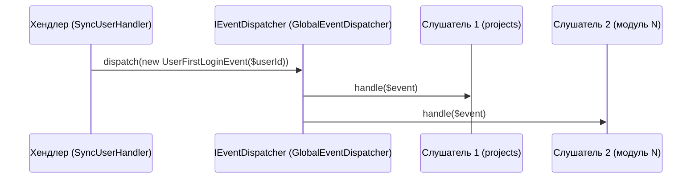

# События ядра и шина событий

> Документ описывает механизм событий: интерфейс `IEventDispatcher`, реализацию `GlobalEventDispatcher`, доменные события ядра и способы подписки (включая подписку модулей на глобальные события).

## 1. Интерфейс `IEventDispatcher`

```php
namespace core\application\port;

interface IEventDispatcher
{
    public function addListener(string $eventClass, callable|string $listener): void;
    public function dispatch(object $event): void;
}
```

- `$listener` — либо callable, либо строка-класс (инстанциируется через контейнер; вызывается метод `handle($event)`, если он существует).

## 2. Реализация `GlobalEventDispatcher`

`core/infrastructure/event/GlobalEventDispatcher.php`:

- Хранит массив `listeners[eventClass][] = listener`.
- `dispatch($event)` — находит слушателей по `get_class($event)`, вызывает по очереди:
  - строковый слушатель → `$container->get($listener)` → `->handle($event)`;
  - callable → `$listener($event)`.
- Регистрируется в DI как синглтон: `IEventDispatcher::class → GlobalEventDispatcher` (см. [configuration.md](./configuration.md)).



## 3. Доменные события ядра

### 3.1. `UserFirstLoginEvent`

**Файл:** `core/domain/event/UserFirstLoginEvent.php`

| Поле | Тип | Описание |
|---|---|---|
| `userId` | int | ID пользователя |
| `occurredAt` | DateTimeImmutable | Время события |

**Когда диспатчится:** в `SyncUserHandler` при **первом** входе пользователя (не существовал локально).

**Кто слушает (по умолчанию):**
- `modules\projects\infrastructure\listener\CreatePersonalProjectOnUserFirstLogin` — создаёт личный проект пользователя (подписка в `modules/projects/config/di.php`).

Других глобальных слушателей в ядре нет — событие «живёт» за счёт подписок модулей.

## 4. События модулей

Каждый модуль имеет собственные доменные события (`modules/<m>/domain/event/`) и свои диспетчеры:

| Модуль | Локальный интерфейс | Реализации | Как связаны с глобальной шиной |
|---|---|---|---|
| projects | `modules\projects\domain\event\IEventDispatcher` | `ModuleEventDispatcher` + `DispatchingEventDecorator` | Декоратор пробрасывает часть событий в глобальный `IEventDispatcher` ядра |
| tasks | `modules\tasks\domain\event\IEventDispatcher` | `ModuleEventDispatcher` + `DispatchingEventDecorator` | Аналогично |
| feedback | (использует глобальный напрямую) | — | Слушатель `SendNonMaxRatingEmailListener` подписан на глобальный `RatingSubmittedEvent` |

Подробно: [projects/entities-events.md](../modules/projects/entities-events.md), [tasks/entities-events.md](../modules/tasks/entities-events.md), [feedback/flow.md](../modules/feedback/flow.md).

## 5. Как подписать слушателя

### 5.1. Локально, внутри модуля
В `modules/<m>/config/di.php` собрать `ModuleEventDispatcher` с массивом `[EventClass::class => [ [$listener, 'method'], ... ]]`.

### 5.2. Глобально (события других модулей / ядра)
```php
/** @var \core\application\port\IEventDispatcher $globalDispatcher */
$globalDispatcher = Yii::$container->get(\core\application\port\IEventDispatcher::class);
$globalDispatcher->addListener(SomeEvent::class, SomeListener::class);
```

### 5.3. Проброс «в мир» (для модулей, использующих декоратор)
В `config/di.php` модуля: `$forwardEvents = [EventClass::class, ...]` передаётся в `DispatchingEventDecorator`, который после локальных слушателей вызывает глобальный диспетчер.

## 6. Рекомендации

1. События — immutable (только геттеры).
2. В событие кладите ID/данные, а не объекты-сущности (меньше связанность).
3. В слушателях НЕ бросайте исключения, способные уронить основной поток (если это не критично); для сбоев используйте логирование.
4. Названия методов слушателей — `handle<Событие>()` (например, `handleTaskCreated()`, `handleProjectCreated()`).