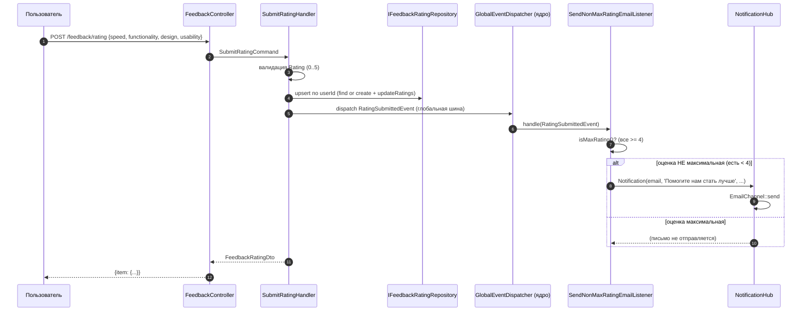
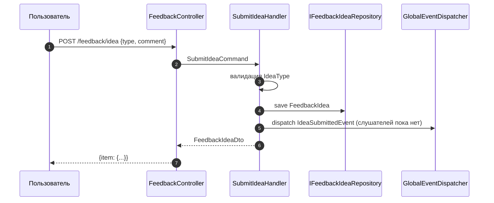

# Поток обратной связи (flow) модуля feedback

> Документ описывает жизненный цикл оценки и идеи: от HTTP-запроса до уведомления.

## 1. Отправка оценки

## 2. Отправка идеи

> `IdeaSubmittedEvent` диспатчится, но не имеет слушателей (каркас для будущих уведомлений/модерации).

## 3. Чтение идей и статистики

| Запрос | Путь | Результат |
|---|---|---|
| Список идей | `GET /feedback/idea` | `FeedbackIdeaDto[]` |
| Статистика | `GET /feedback/stats` | `FeedbackStatsDto` |

## 4. Ключевые правила

- **Одна оценка на пользователя**: `feedback_rating.user_id` — UNIQUE; повторная отправка обновляет (`updateRatings`).
- **Диапазон оценки**: 0–5 (`Rating` VO); нарушение → `InvalidArgumentException`.
- **«Максимальная оценка»**: `isMaxRating()` = все 4 критерия ≥ 4. Письмо уходит только при оценке 0–3 хотя бы по одному критерию.
- **Типы идей**: `idea`, `bug`, `feature`, `improvement`, `question`.

## 5. Таблицы

| Таблица | Поля (основные) |
|---|---|
| `feedback_rating` | `id`, `user_id` (UNIQUE, FK→users), `speed`, `functionality`, `design`, `usability` (CHECK 0–5), даты |
| `feedback_idea` | `id`, `user_id`, `type`, `comment`, `is_implemented`, даты |