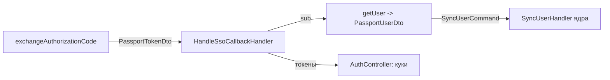

# DTO модуля passport/auth

> DTO модуля используются внутри обработчиков и контроллера; наружу (в HTTP-ответ) почти не попадают — наружу уходят куки и редиректы.

## 1. `PassportTokenDto`

**Файл:** `modules/passport/auth/application/dto/PassportTokenDto.php`

Иммутабельный объект с парой токенов, полученных от Passport.

```php
final class PassportTokenDto
{
    public function __construct(
        public readonly string $accessToken,     // JWT Access Token
        public readonly ?string $refreshToken,   // Refresh Token (может отсутствовать)
        public readonly int $expiresIn,          // TTL в секундах
        public readonly array $scopes,           // string[] — список OAuth-скоупов
        public readonly string $tokenType = 'Bearer',
    ) {}
}
```

| Поле | Тип | Описание |
|---|---|---|
| `accessToken` | string | JWT access-токен |
| `refreshToken` | ?string | Refresh-токен (null, если Passport не вернул) |
| `expiresIn` | int | Время жизни access-токена, сек |
| `scopes` | string[] | Разрешённые скоупы |
| `tokenType` | string | `Bearer` (по умолчанию) |

**Как создаётся:** `PassportHttpClient::parseTokenResponse()` из ответа `POST /token`. Парсит `data.access_token`, `data.refresh_token`, `data.scope|scopes`, `data.expires_in`, `data.token_type`.

## 2. `PassportUserDto`

**Файл:** `modules/passport/auth/application/dto/PassportUserDto.php`

Данные пользователя, полученные от Passport (`GET /users/{id}`).

```php
final class PassportUserDto
{
    public function __construct(
        public readonly string $id,          // sub / user id в Passport
        public readonly string $surname,
        public readonly string $name,
        public readonly ?string $patronymic,
        public readonly string $email,
        public readonly ?string $post,       // должность (из /posts)
        public readonly bool $isOwner,       // владелец ли
    ) {}
}
```

| Поле | Тип | Источник |
|---|---|---|
| `id` | string | `data.id` / `data.sub` (fallback: переданный id) |
| `surname` | string | `data.surname` |
| `name` | string | `data.name` |
| `patronymic` | ?string | `data.patronymic` |
| `email` | string | `data.email` |
| `post` | ?string | Название должности из `GET /posts?ids={post_id}` (или `data.post`) |
| `isOwner` | bool | `data.isOwner` / `data.is_owner`; либо определяется через `roles` (проверка роли `owner` через `GET /roles?ids=...`) |

## 3. Как DTO связаны с потоком



- `HandleSsoCallbackHandler` получает `PassportTokenDto`, из него берёт `accessToken` для `getUser()` и `sub` для идентификации.
- `PassportUserDto` конвертируется в `SyncUserCommand` (ядро) — см. [core/commands-queries.md](../../core/commands-queries.md#31-синхронизация-с-passport--syncusercommand--syncuserhandler).