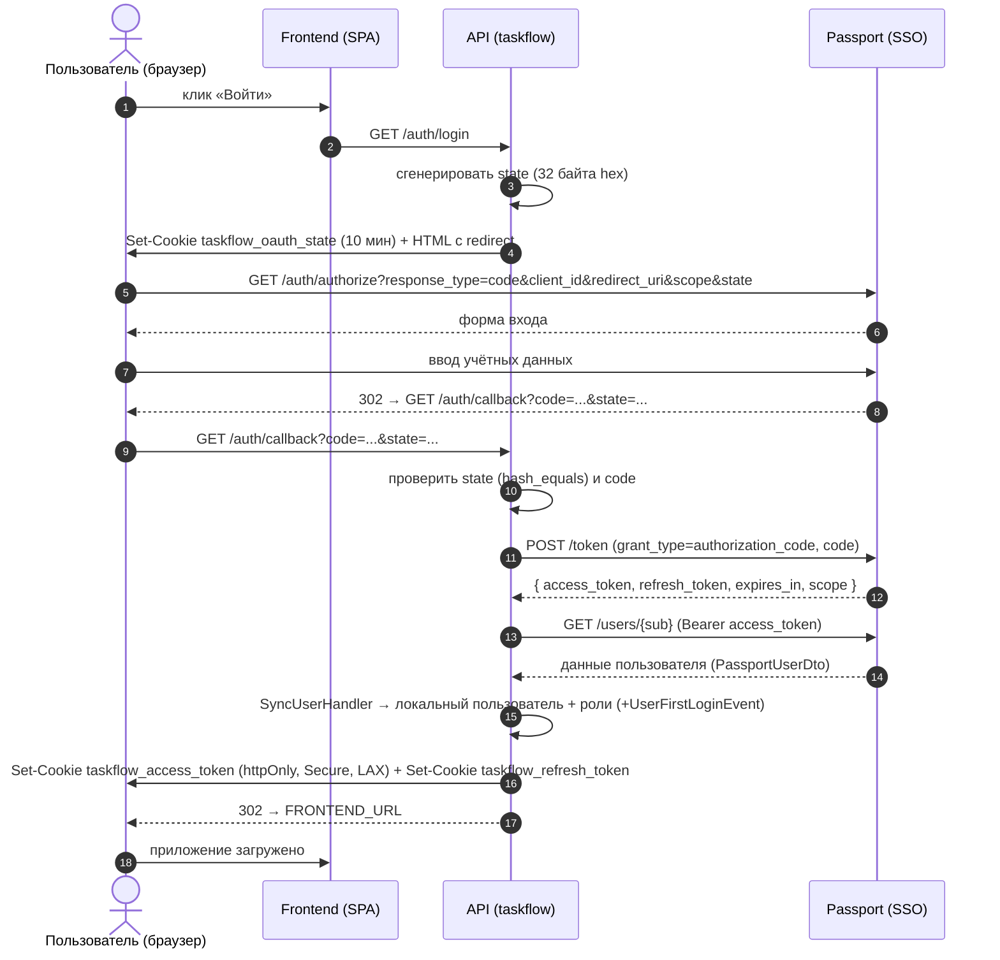
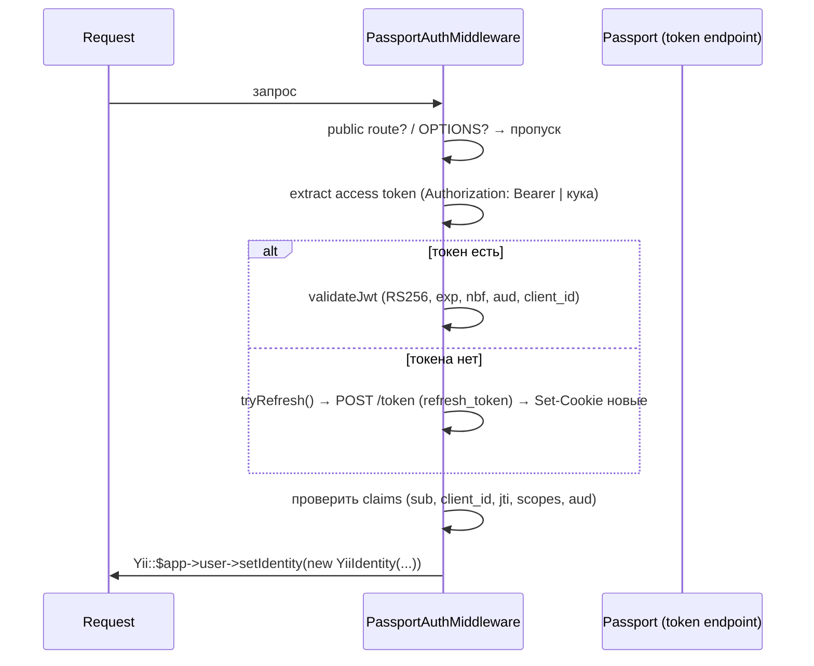

# SSO-поток (Flow) модуля passport/auth

> Документ детально описывает поток аутентификации: логин, callback, обновление токенов, выход.

## 1. Общая схема



## 2. GET /auth/login

Обработчик `AuthController::actionLogin`:

1. Генерирует `state = bin2hex(random_bytes(32))`.
2. Ставит куку `taskflow_oauth_state` (httpOnly, Secure, SameSite=LAX, path=/auth, TTL 600 с).
3. `InitiateSsoLoginHandler->handle(new InitiateSsoLoginCommand($state))` → `PassportHttpClient::buildAuthorizationUrl()`:
   ```
   {passport_url}/auth/authorize?response_type=code&client_id={client_id}&redirect_uri={app_url}/auth/callback&scope={scopes}&state={state}
   ```
4. Возвращает HTML-страницу «Переадресация PASSPORT» с meta-редиректом через 3.1 c.

## 3. GET /auth/callback

Обработчик `AuthController::actionCallback`:

1. Читает `code` и `state` из query. Если нет — `BadRequestHttpException`.
2. Читает ожидаемый state из куки `taskflow_oauth_state`, удаляет куку.
3. `HandleSsoCallbackHandler->handle(new HandleSsoCallbackCommand($code, $state, $expectedState))`:
   - `hash_equals($expectedState, $state)` — защита CSRF; при несовпадении `RuntimeException`.
   - `PassportHttpClient::exchangeAuthorizationCode($code)` → POST `{passport_url}/token` (grant_type=authorization_code, client_id, client_secret, code, redirect_uri).
   - Декодирует payload access-токена (без проверки подписи — токен получен от Passport напрямую по HTTPS), берёт `sub`.
   - `PassportHttpClient::getUser($sub, $accessToken)` → GET `{passport_url}/users/{sub}` (дополнительно /posts и /roles для должности и проверки роли `owner`).
   - `SyncUserHandler->handle(new SyncUserCommand(...))` — создаёт/обновляет локального пользователя, назначает роли `user` (+`admin` для owner), диспатчит `UserFirstLoginEvent` при первом входе.
4. Возвращает `PassportTokenDto`.
5. Контроллер ставит куки:
   - `taskflow_access_token` = access_token (TTL = expires_in)
   - `taskflow_refresh_token` = refresh_token (TTL = OAUTH2_REFRESH_TOKEN_TTL)
   - обе: httpOnly, Secure, SameSite=LAX, path=/
6. Возвращает HTML-страницу «Договариваемся с PASSPORT» → meta-редирект на FRONTEND_URL.

## 4. Защита API-запросов (PassportAuthMiddleware)

Вызывается каждый запрос через `on beforeRequest` (config/web.php), до контроллера.

Поток:



Детали валидации JWT и ошибок — в [security.md](./security.md).

## 5. GET /auth/logout

1. Проксирует в Passport: `PassportHttpClient::logout(cookieHeader, authorization)` → GET `{passport_url}/auth/logout` с передачей Cookie/Authorization.
2. Переносит Set-Cookie/Location/Content-Type из ответа Passport в ответ API.
3. Удаляет локальные куки `taskflow_access_token` и `taskflow_refresh_token`.
4. Возвращает статус и тело Passport как есть (`Response::FORMAT_RAW`).

## 6. Куки — сводка

| Кука | Когда ставится | TTL | Path | Флаги |
|---|---|---|---|---|
| `taskflow_oauth_state` | /auth/login | 600 c | /auth | httpOnly, Secure, SameSite=LAX |
| `taskflow_access_token` | /auth/callback, refresh | expires_in (default 3600) | / | httpOnly, Secure, SameSite=LAX |
| `taskflow_refresh_token` | /auth/callback, refresh | OAUTH2_REFRESH_TOKEN_TTL (default 2592000) | / | httpOnly, Secure, SameSite=LAX |

> При refresh выставляются обновлённые access+refresh куки (refresh может быть null — тогда только access).

## 7. Ошибки SSO

| Ситуация | Ответ |
|---|---|
| Нет `code`/`state` в callback | 400 Bad Request |
| `state` не совпадает / отсутствует кука | 400 Bad Request |
| code пустой | RuntimeException (→ 500/400 через обработчик) |
| Токен Passport без `sub` | RuntimeException |
| Публичный ключ недоступен | RuntimeException |
| JWT невалиден (подпись/exp/aud) | 401 Unauthorized (WWW-Authenticate: Bearer) |
| refresh не сработал | 401 Unauthorized |