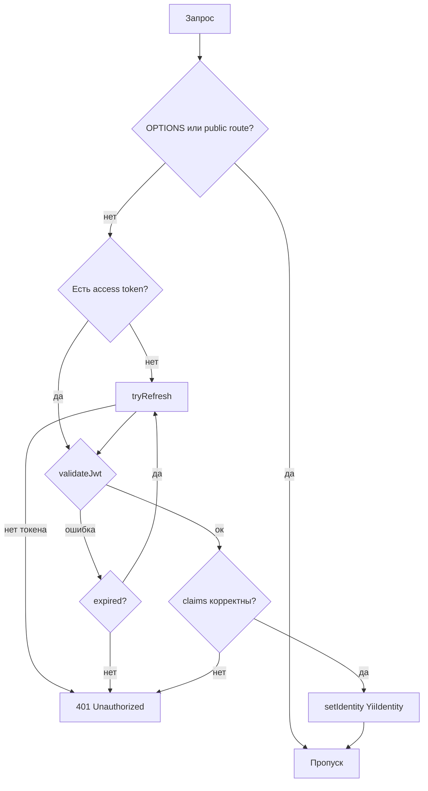
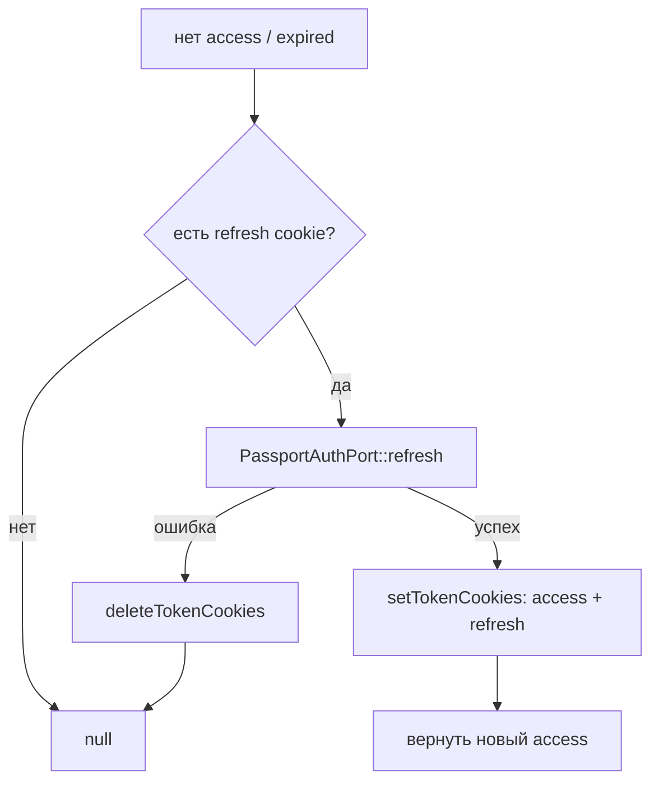

# Безопасность модуля passport/auth (PassportAuthMiddleware)

> Документ описывает middleware аутентификации: как извлекается токен, как валидируется JWT, как работает refresh и как устанавливается `YiiIdentity`.

## 1. Место в пайплайне

`config/web.php`:
```php
'on beforeRequest' => static function (): void {
    Yii::$container->get(PassportAuthMiddleware::class)->handle();  // сначала
    Yii::$container->get(RbacMiddleware::class)->handle();          // потом
},
```

PassportAuthMiddleware выполняется **до** RBAC.

## 2. Порядок работы `handle()`



## 3. Извлечение токена

`extractAccessToken()`:

1. Заголовок `Authorization: Bearer <token>` (регэксп).
2. Иначе кука `taskflow_access_token`.

## 4. Валидация JWT (`validateJwt`)

| Шаг | Проверка |
|---|---|
| Структура | ровно 3 части (header.payload.signature) |
| Header | `alg === 'RS256'` |
| Ключ | файл `OAUTH2_PUBLIC_KEY_PATH` существует и читается |
| Подпись | `openssl_verify` с публичным ключом, `OPENSSL_ALGO_SHA256` |
| `exp` | числовая и > now |
| `nbf` | если есть — ≤ now |
| `client_id` | если есть в payload — должен совпадать с нашим client_id |
| `aud` | должен содержать наш client_id |

При любой ошибке — `RuntimeException` с текстом; middleware преобразует в `401 Unauthorized` (кроме статуса «Access token expired» — пытается refresh).

## 5. Refresh (`tryRefresh`)



- Обновляет и access, и refresh куки.
- При неудаче — удаляет обе куки и возвращает null → 401.

## 6. Проверка claims и установка identity

Токен должен содержать:
- `sub` (string|int) — субъект;
- `client_id` (string) ИЛИ `aud` (содержащий наш client);
- `jti` (string) — ID токена;
- `scopes` (array).

Устанавливается:

```php
Yii::$app->user->setIdentity(new YiiIdentity(
    (string)$sub,
    (string)($clientId ?? $audience),
    (string)$tokenId,
    array_values(array_map('strval', $scopes)),
    'user',
));
```

## 7. Public routes

Из `modules/passport/auth/config/params.php`:

```php
'public_routes' => [
    'GET /',
    'GET /auth/*',
    'GET /gii',
    'GET /debug',
    'GET /debug/*',
    'GET /docs',
    'GET /docs/*',
    'OPTIONS *',
],
```

Сопоставление: `'МЕТОД шаблон'`, поддерживаются точное совпадение, `*`-суффикс, `<param>`-плейсхолдеры.

## 8. Куки (повтор)

| Имя | Назначение | Флаги (жёстко в коде) |
|---|---|---|
| `taskflow_access_token` | access JWT | httpOnly, Secure, SameSite=LAX, path=/ |
| `taskflow_refresh_token` | refresh JWT | httpOnly, Secure, SameSite=LAX, path=/ |
| `taskflow_oauth_state` | защита SSO | httpOnly, Secure, SameSite=LAX, path=/auth |

> Имена кук — параметры модуля, но сами флаги `httpOnly/Secure/SameSite=LAX` зашиты в код middleware и контроллера.

## 9. Потенциальные нюансы (см. known-issues)

- `secure = true` — куки не установятся по `http://` (локально — только HTTPS/локальный хост с доверием браузера).
- Refresh-токен в куке отправляется автоматически; для `fetch` нужен `credentials: 'include'`.