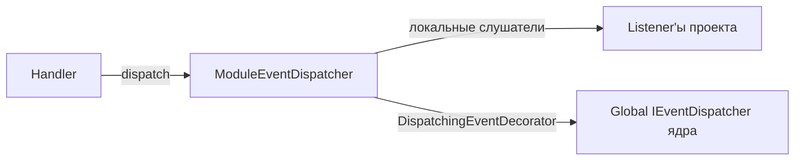

# Архитектура модуля projects

> Документ описывает слои модуля, сущности и ключевые классы.

## 1. Структура

```
modules/projects/
├── Module.php
├── application/
│   ├── assembler/       # ProjectDtoAssembler, BoardDtoAssembler, ProjectUserDtoAssembler
│   ├── command/         # Create/Update/Delete Project, Board, Member, Invitation
│   ├── dto/             # ProjectDto, BoardDto, ProjectUserDto
│   ├── handler/         # CreateProjectHandler, … (18 хендлеров)
│   ├── port/            # IProjectAccess
│   └── query/           # GetProjectQuery, ListUserProjectsQuery, …
├── config/
│   ├── di.php           # репозитории, access, слушатели, шина событий
│   └── routing.php      # маршруты проекта/доски/участника/приглашения
├── domain/
│   ├── entity/          # Project, Board, Invitation, ProjectUser
│   ├── event/           # ProjectCreatedEvent, InvitationAcceptedEvent, …
│   ├── repository/      # IProjectRepository, IBoardRepository, IProjectUserRepository, IInvitationRepository
│   └── valueObject/     # ProjectId, BoardId, ProjectType, InvitationStatus, UserRole, Settings
├── infrastructure/
│   ├── access/          # ProjectAccess (реализация IProjectAccess)
│   ├── event/           # ModuleEventDispatcher, DispatchingEventDecorator
│   ├── listener/        # AddOwnerAsMemberListener, SendInvitationEmailListener,
│   │                    # CreatePersonalProjectOnUserFirstLogin, ProjectLoggerListener
│   ├── migrations/      # project, board, project_user, project_invitation
│   ├── persistence/     # ProjectAR, BoardAR, ProjectUserAR, InvitationAR
│   └── repository/      # DbProjectRepository, DbBoardRepository, DbProjectUserRepository, DbInvitationRepository
└── presentation/
    ├── controller/      # ProjectController, BoardController, ProjectMemberController, InvitationController
    └── request/         # CreateProjectRequest, UpdateProjectRequest, CreateBoardRequest, …
```

## 2. Слои и правила

- **presentation**: контроллеры вызывают хендлеры, валидируют request-модели, возвращают DTO через `BaseController`.
- **application**: хендлеры выполняют сценарии (create/update/delete/invite...), работают с доменными сущностями и репозиториями (порты).
- **domain**: сущности с инвариантами; value objects; доменные события; интерфейсы репозиториев.
- **infrastructure**: AR-модели, SQL-реализации репозиториев, `ProjectAccess`, слушатели событий, шина событий.

## 3. Сущности

### 3.1. Project
- Поля: `id`, `name` (не пустое, ≤255), `type`, `ownerId`, `settings` (Settings VO), `createdAt`, `updatedAt`.
- Методы: `rename()`, `changeSettings()`, `isOwner()`.
- Инварианты: имя не пустое и ≤ 255 символов.

### 3.2. Board
- Поля: `id`, `projectId`, `name`, `description`, `createdBy`, `settings`, даты.
- Принадлежит проекту; `createdBy` — создатель.

### 3.3. ProjectUser
- Поля: `projectId`, `userId`, `role` (UserRole VO: owner/admin/member), `invitedBy`, `invitedAt`, `acceptedAt`, `joinedAt`.
- Связывает пользователя с проектом и его ролью.

### 3.4. Invitation
- Поля: `id`, `projectId`, `email`, `token`, `status` (InvitationStatus: pending/accepted/cancelled), `invitedBy`, даты.
- Токен — для принятия приглашения.

## 4. Value objects

| VO | Описание |
|---|---|
| `ProjectId`, `BoardId` | ID (наследуют `AbstractIntId`) |
| `ProjectType` | Тип проекта: `personal`, `collaborative`, `corporate` (+ др.) |
| `InvitationStatus` | Статус приглашения: pending / accepted / cancelled |
| `UserRole` | Роль участника в проекте: owner / admin / member |
| `Settings` | Произвольные настройки (merge) |

## 5. События (кратко)

События модуля (подробно — [entities-events.md](./entities-events.md)):

`ProjectCreatedEvent`, `ProjectMemberAddedEvent`, `ProjectMemberRemovedEvent`, `BoardCreatedEvent`, `InvitationCreatedEvent`, `InvitationAcceptedEvent`, `InvitationCancelledEvent`.

Распространение:



## 6. DI: ключевые связи

См. [configuration.md](./configuration.md). Основное:

- Репозитории: `Db*Repository` (AR).
- `IProjectAccess` → `ProjectAccess`.
- Слушатели: `AddOwnerAsMemberListener`, `SendInvitationEmailListener`, `ProjectLoggerListener`.
- `ModuleEventDispatcher` собирается из карты событие→слушатели.
- `DispatchingEventDecorator` пробрасывает `$forwardEvents` в глобальную шину.
- `CreatePersonalProjectOnUserFirstLogin` подписывается на глобальный `UserFirstLoginEvent`.