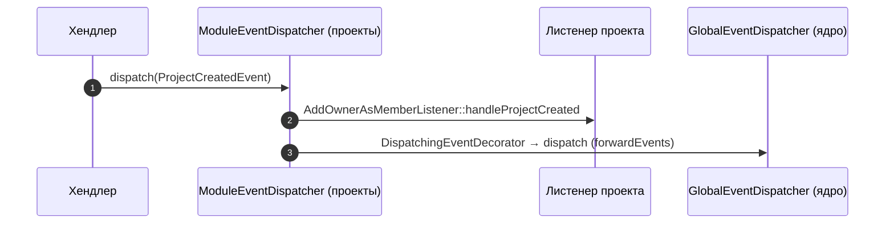

# Сущности, события и листенеры модуля projects

> Документ описывает доменные сущности, события и реакцию на них (листенеры).

## 1. Сущности

### 1.1. `Project` (entity/Project.php)

Поля:
- `id: ProjectId`
- `name: string` (не пустое, ≤255)
- `type: ProjectType`
- `ownerId: UserId`
- `settings: Settings`
- `createdAt`, `updatedAt: DateTimeImmutable`

Методы: `rename(name)`, `changeSettings(array)`, `isOwner(UserId): bool`, `setId()` (для репозитория).

### 1.2. `Board` (entity/Board.php)

Поля: `id`, `projectId`, `name`, `description`, `createdBy: UserId`, `settings`, `createdAt`, `updatedAt`.

### 1.3. `ProjectUser` (entity/ProjectUser.php)

Поля: `projectId`, `userId`, `role: UserRole`, `invitedBy`, `invitedAt`, `acceptedAt`, `joinedAt`.

Роли участника (VO `UserRole`): `owner`, `admin`, `member`.

### 1.4. `Invitation` (entity/Invitation.php)

Поля: `id`, `projectId`, `email`, `token`, `status: InvitationStatus`, `invitedBy`, `createdAt`, `updatedAt` (+ `acceptedAt`/`cancelledAt` по реализации).

Статусы (VO `InvitationStatus`): `pending`, `accepted`, `cancelled`.

## 2. События

Все события — в `modules/projects/domain/event/`:

| Событие | Когда | Данные |
|---|---|---|
| `ProjectCreatedEvent` | Создан проект | projectId, ownerId |
| `ProjectMemberAddedEvent` | Добавлен участник | projectId, userId |
| `ProjectMemberRemovedEvent` | Удалён участник | projectId, userId |
| `BoardCreatedEvent` | Создана доска | boardId, projectId |
| `InvitationCreatedEvent` | Создано приглашение | invitationId, email |
| `InvitationAcceptedEvent` | Приглашение принято | invitationId, userId |
| `InvitationCancelledEvent` | Приглашение отменено | invitationId |

## 3. Листенеры

### 3.1. `AddOwnerAsMemberListener`
- Событие: `ProjectCreatedEvent`.
- Добавляет владельца в `project_user` с ролью `owner` (или `admin`).

### 3.2. `SendInvitationEmailListener`
- Событие: `InvitationCreatedEvent`.
- Формирует `Notification` (email) и отправляет через `NotificationHub` (ядро): «Вас пригласили в проект + ссылка для принятия».

### 3.3. `CreatePersonalProjectOnUserFirstLogin`
- Событие: `UserFirstLoginEvent` (ядро).
- Создаёт личный проект `«Личный проект пользователя #<id>»` типа `personal` для нового пользователя.
- Ошибки не роняют поток — логируются (`projects`).

### 3.4. `ProjectLoggerListener`
- События: все события модуля.
- Пишет логи в категорию `projects` (`Yii::info`).

## 4. Распространение событий



## 5. Глобальная подписка

В `modules/projects/config/di.php`:

```php
$globalDispatcher = Yii::$container->get(GlobalEventDispatcher::class);
$globalDispatcher->addListener(UserFirstLoginEvent::class, CreatePersonalProjectOnUserFirstLogin::class);
```

Это связывает проекты с ядром: при первом входе любого нового пользователя ему создаётся личный проект.

## 6. Миграции модуля

| Миграция | Таблица |
|---|---|
| `m260317_174252_create_project_table.php` | `project` |
| `m260317_174349_create_board_table.php` | `board` |
| `m260317_174437_create_project_user_table.php` | `project_user` |
| `m260331_035731_create_project_invitation_table.php` | `project_invitation` |