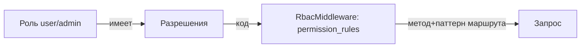

# Модуль rbac (роли и разрешения)

> Модуль отвечает за авторизацию: роли, разрешения (permissions), ранговую иерархию и контроль доступа к маршрутам API через `RbacMiddleware`. Глобальные роли хранятся в ядре (`roles`, `user_roles`), а разрешения — в таблицах модуля (`permissions`, `role_permissions`).

## Документы модуля

| Документ | Содержание |
|---|---|
| [architecture.md](./architecture.md) | Слои, ключевые классы, модель разрешений |
| [middleware.md](./middleware.md) | `RbacMiddleware`: public_routes, permission_rules, субъект-резолверы |
| [permissions.md](./permissions.md) | Таблица permissions, роли, ранги, политика назначения |
| [configuration.md](./configuration.md) | Параметры модуля (params.php), DI, routing |
| Также: [security ядра](../../core/security.md) для YiiIdentity | |

## Структура модуля

```
modules/rbac/
├── Module.php
├── application/
│   ├── dto/            # PermissionDto
│   ├── port/           # IAuthorizationService, IPermissionRepository, IRoleAssignmentPolicy, ISubjectResolver
│   └── service/        # AuthorizationService
├── config/
│   ├── di.php
│   ├── params.php      # public_routes, permission_rules, role_ranks
│   └── routing.php     # rbac/permissions, rbac/roles/<id>/permissions
├── domain/
│   └── valueObject/    # Permission
├── infrastructure/
│   ├── migrations/     # permissions, role_permissions (+seed)
│   └── repository/     # DbPermissionRepository, DbRoleAssignmentPolicy, DbSubjectResolver
└── presentation/
    ├── controller/     # PermissionController, RolePermissionController
    └── middleware/     # RbacMiddleware
```

## Ключевые классы

| Класс | Роль |
|---|---|
| `RbacMiddleware` | Проверяет каждый запрос по правилам (после PassportAuth) |
| `AuthorizationService` | Логика проверки разрешения с контекстом (self/any/owner) |
| `DbPermissionRepository` | Читает permissions и связи роль-разрешение |
| `DbRoleAssignmentPolicy` | Политика: можно ли назначить роль (ранговая иерархия) |
| `DbSubjectResolver` | Определяет владельца ресурса (для owner-правил) |
| `Permission` | VO разрешения (код) |
| `PermissionDto` | DTO разрешения |

## Краткая модель



- **Роли** (ядро `roles`): `user`, `admin`.
- **Разрешения** (модуль `permissions`): коды вида `users.read.self`, `roles.manage` и т.п.
- **Связь**: `role_permissions` (роль ↔ разрешение).
- **Правила маршрутов** (`permission_rules` в params.php): сопоставляют `(HTTP-метод, URL-паттерн)` → код разрешения.
- **Ранги** (`role_ranks`): иерархия — admin(50) > user(10). Можно назначать только роли с рангом ниже собственного.

## Взаимодействие

- Вызывается из `config/web.php` `on beforeRequest` **после** `PassportAuthMiddleware`.
- Использует `YiiIdentity` (ядро) для определения субъекта.
- Исключения: `PermissionDeniedException` (403), `UnauthorizedHttpException` (401).

Детали: [middleware.md](./middleware.md), [permissions.md](./permissions.md), [configuration.md](./configuration.md).