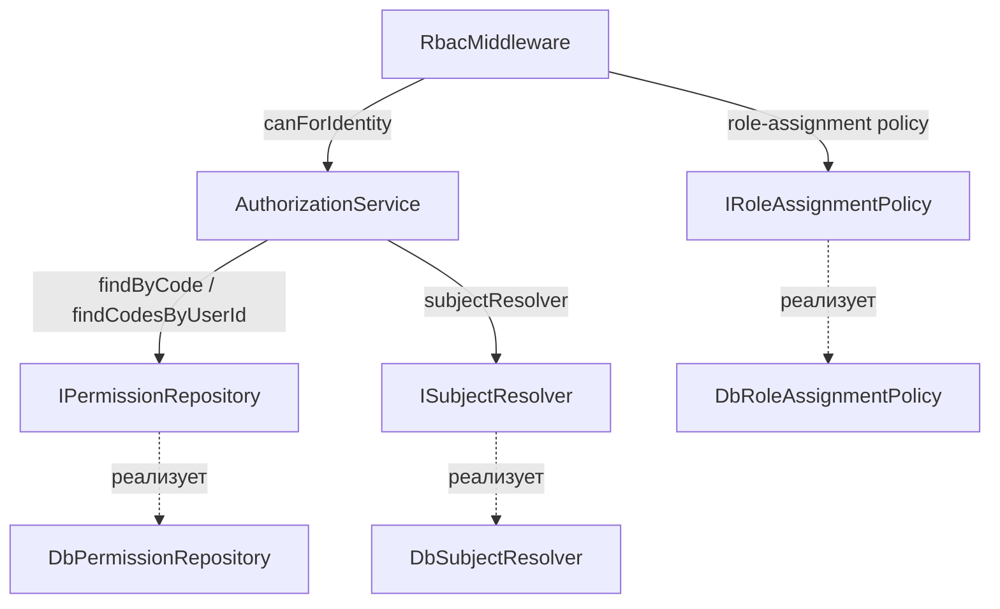

# Архитектура модуля rbac

> Документ описывает слои модуля и ключевую логику авторизации: определение разрешения, контекст (self/any/owner), сопоставление с выданными разрешениями.

## 1. Слои



## 2. `AuthorizationService`

**Файл:** `modules/rbac/application/service/AuthorizationService.php`

Реализует `IAuthorizationService`:

```php
interface IAuthorizationService
{
    public function can(int $userId, string $permission, array $context = []): bool;
    public function canForIdentity(YiiIdentity $identity, string $permission, array $context = []): bool;
    public function authorize(int $userId, string $permission, array $context = []): void;
    public function authorizeForIdentity(YiiIdentity $identity, string $permission, array $context = []): void;
}
```

### 2.1. `can(int $userId, string $permission, array $context)`

1. Проверяет, что текущий аутентифицированный пользователь == `$userId`.
2. `resolveConcretePermission($permission, $context)` — превращает абстрактное разрешение в конкретное (см. 3).
3. `permissionRepository->findByCode($concrete)` — если такого разрешения нет → `false`.
4. `getUserPermissions($userId)` — кэшированные коды разрешений пользователя (на основе `role_permissions` через роли).
5. `matches($assigned, $concrete)` — сопоставление с учётом wildcard (см. 4).

### 2.2. `canForIdentity(YiiIdentity $identity, ...)`

- **Если `$identity->isUser()`**: требует числовой ID, вызывает `can()`.
- **Иначе (клиент/приложение)**: проверяет `getClientId()` не пустой, разрешение резолвится через `resolveClientPermission()`; проверяется существование разрешения в БД. Возвращает `true` (клиентские доступы трактуются как разрешённые, если разрешение определено).

### 2.3. `authorize*` — бросают `PermissionDeniedException` при отказе (см. [core/exceptions.md](../../core/exceptions.md)).

## 3. Резолюция конкретного разрешения (`resolveConcretePermission`)

Логическое разрешение (например, `users.read`) превращается в конкретное:

| `mode` (context) | Результат |
|---|---|
| `any` (по умолчанию) | `permission` как есть |
| `self-or-any` + `subjectUserId == userId` | `permission.self` |
| `self-or-any` + `subjectUserId != userId` | `permission.any` |
| `self-or-any` + нет subjectUserId | `permission.any` |
| `self-or-any` + subject не резолвится (`subjectResolved=false`) | `__unresolvable_subject__` (всегда false) |
| `owner-only` | `permission.self` |

### Для клиентов (`resolveClientPermission`)

| mode | Результат |
|---|---|
| `self-or-any` / `owner-only` | `.self` → `.any`; `.any` → как есть; иначе `permission.any` |
| иначе | permission как есть |

## 4. Сопоставление выданных разрешений (`matches`)

```php
private function matches(array $assigned, string $required): bool
{
    if (in_array('*', $assigned, true)) return true;          // супер-разрешение
    if (in_array($required, $assigned, true)) return true;    // точное
    // блуждающие wildcard: «roles.*» покрывает «roles.manage», «roles.read» и т.д.
    $parts = explode('.', $required);
    while (count($parts) > 1) {
        array_pop($parts);
        if (in_array(implode('.', $parts) . '.*', $assigned, true)) return true;
    }
    return false;
}
```

Пример: у роли `admin` есть `roles.manage`; запрос `roles.read` → попытка `roles.*`? Нет → false. Отдельно у admin есть и `roles.read`.

## 5. Кэш разрешений

- `AuthorizationService::$permissionCache[userId]` — кэш кодов разрешений пользователя на время запроса (`??=`).
- Наполняется из `IPermissionRepository::findCodesByUserId()`.

## 6. IPermissionRepository

```php
interface IPermissionRepository
{
    public function findByCode(string $code): ?Permission;
    public function findCodesByUserId(int $userId): array;   // string[] кодов
    // + методы для CRUD permissions (PermissionController)
}
```

Реализация — `DbPermissionRepository` (таблицы `permissions`, `role_permissions`).

## 7. ISubjectResolver

Определяет, кому принадлежит ресурс (для правил с `source: 'owner'`):

```php
interface ISubjectResolver
{
    public function resolveOwner(array $params): ?int;   // ['resource' => ..., 'id' => ...]
}
```

Реализация — `DbSubjectResolver` (по resource и id находит владельца; для задач — проект/доску).

## 8. IRoleAssignmentPolicy

Проверяет возможность назначения/снятия ролей:

```php
interface IRoleAssignmentPolicy
{
    public function canAssign(int $actorUserId, int $targetUserId, int $targetRoleId): bool;
    public function canRemove(int $actorUserId, int $userRoleId): bool;
}
```

Реализация — `DbRoleAssignmentPolicy` (ранговая иерархия, см. [permissions.md](./permissions.md)).