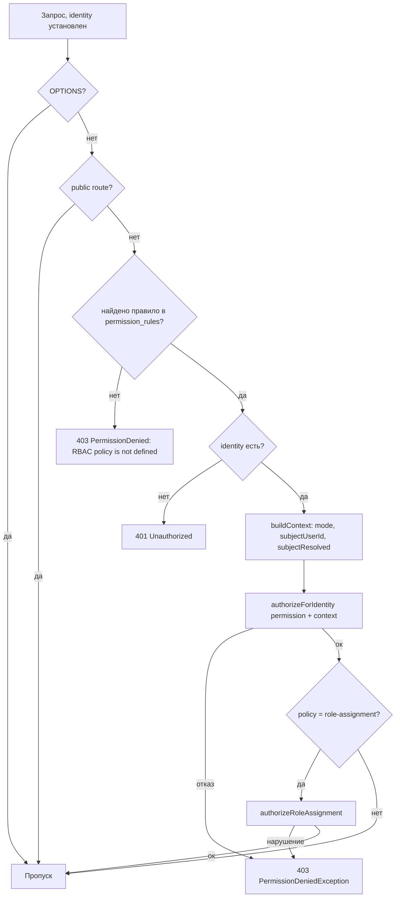

# RbacMiddleware: контроль доступа к маршрутам

> Документ описывает работу `RbacMiddleware` — второго middleware в пайплайне запроса (после PassportAuthMiddleware).

## 1. Поток



## 2. Public routes

Список из `params.php` (`public_routes`), формат `'МЕТОД шаблон'`:

```
GET /            GET /auth/*       GET /gii       GET /debug      GET /debug/*
GET /docs        GET /docs/*       OPTIONS *      (и др.)
```

`isPublic()` поддерживает:
- точное совпадение;
- `*` (любой путь);
- суффикс `*` (префикс);
- `<param>`-плейсхолдеры (заменяются на `[^/]+`).

## 3. Правила (permission_rules)

Формат элемента:

```php
[
    'method'     => 'GET',                        // HTTP-метод
    'pattern'    => '~^/users/(?<userId>\d+)$~',  // regex пути
    'permission' => 'users.read',                 // логическое разрешение
    'subject'    => [                             // опционально
        'mode'   => 'self-or-any',                // any | self-or-any | owner-only
        'source' => 'path',                       // path | query | body | owner
        'key'    => 'userId',                     // имя параметра/переменной
        // для owner: 'ownerKey' => 'id' (паттерн-группа)
    ],
    'policy'     => 'role-assignment',            // опционально: спец. политика
]
```

### Примеры (из `params.php`)

```php
['method' => 'GET',  'pattern' => '~^/users$~', 'permission' => 'users.list'],
[
    'method' => 'GET',
    'pattern' => '~^/users/(?<userId>\\d+)$~',
    'permission' => 'users.read',
    'subject' => ['mode' => 'self-or-any', 'source' => 'path', 'key' => 'userId'],
],
['method' => 'POST', 'pattern' => '~^/user-roles$~', 'permission' => 'user_roles.manage', 'policy' => 'role-assignment'],
['method' => 'GET',  'pattern' => '~^/rbac/permissions$~', 'permission' => 'rbac.permissions.manage'],
```

## 4. buildContext()

Собирает контекст для `AuthorizationService`:

| Поле | Источник |
|---|---|
| `userId` | `YiiIdentity->getId()` (если isUser) |
| `subjectUserId` | по `subject.source`: `path` → группа regex (key), `query` → `Yii::$app->request->get(key)`, `body` → body param (key), `owner` → `subjectResolver->resolveOwner(['resource'=>key,'id'=>...])` |
| `subjectResolved` | `true`/`false` (для owner: false, если владелец не определён) |
| `mode` | `subject.mode` (любой) |

## 5. authorizeRoleAssignment (policy)

Вызывается только для правил с `'policy' => 'role-assignment'` (POST /user-roles, DELETE /user-roles/<id>):

- **POST /user-roles**: берёт `userId`, `roleId` из body; `roleAssignmentPolicy->canAssign(actor, target, role)` — проверка рангов.
- **DELETE /user-roles/<id>**: достаёт `userRoleId` из пути; `canRemove(actor, userRoleId)`.

При нарушении → `PermissionDeniedException('Role hierarchy violation')`.

## 6. Ошибки

| Ситуация | Ответ |
|---|---|
| Нет правила для маршрута | 403 `RBAC policy is not defined for this route` |
| Нет identity | 401 `Authentication required` |
| Нет разрешения | 403 `Permission denied: <permission>` + details |
| Нарушение role-assignment | 403 `Role hierarchy violation` |

## 7. Связь с PermissionController / RolePermissionController

- `GET /rbac/permissions` — список всех permission (нужен `rbac.permissions.manage`).
- `GET /rbac/roles/{roleId}/permissions` — разрешения роли.
- `POST|DELETE /rbac/roles/{roleId}/permissions/{permissionId}` — выдать/отозвать.