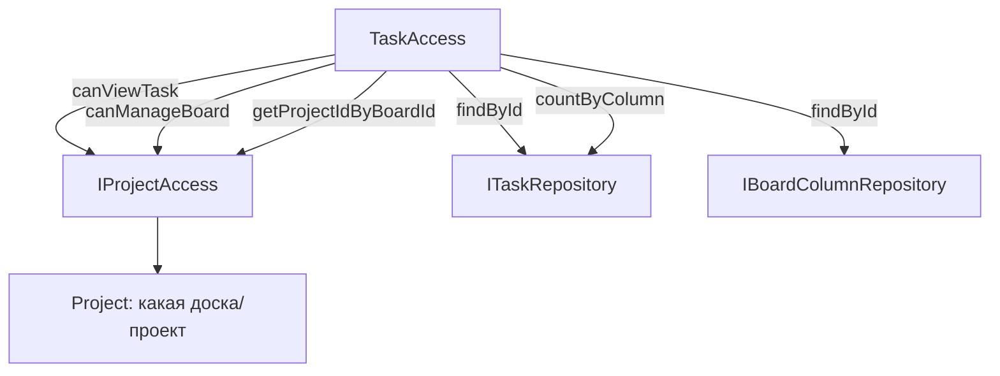

# Управление доступом в модуле tasks (ITaskAccess / TaskAccess)

> Документ описывает права на задачи и колонки в рамках модуля tasks. Все проверки делегируются в `IProjectAccess` (модуль projects), т.к. задачи/колонки живут внутри досок проектов.

## 1. Порт `ITaskAccess`

**Файл:** `modules/tasks/application/port/ITaskAccess.php`

```php
interface ITaskAccess
{
    public function getProjectIdsByColumnId(int $columnId): array;
    public function canViewTask(int $userId, int $taskId): bool;
    public function canCreateTask(int $userId, int $boardId): bool;
    public function canUpdateTask(int $userId, int $taskId): bool;
    public function canDeleteTask(int $userId, int $taskId): bool;
    public function canHardDeleteTask(int $userId, int $taskId): bool;
    public function canRestoreTask(int $userId, int $taskId): bool;
    public function canAssignTask(int $userId, int $taskId, int $assigneeId): bool;
    public function canCommentOnTask(int $userId, int $taskId): bool;
    public function canAddStickerToTask(int $userId, int $taskId): bool;
    public function canCreateColumn(int $userId, int $boardId): bool;
    public function canUpdateColumn(int $userId, int $columnId): bool;
    public function canDeleteColumn(int $userId, int $columnId): bool;
    public function canMoveTaskToColumn(int $userId, int $taskId, int $columnId): bool;
}
```

## 2. Реализация `TaskAccess`

**Файл:** `modules/tasks/infrastructure/access/TaskAccess.php`

Зависимости: `ITaskRepository`, `IBoardColumnRepository`, `IProjectAccess`.

### Правила

| Метод | Логика |
|---|---|
| `getProjectIdsByColumnId` | колонка → доска → проект (через `IProjectAccess::getProjectIdByBoardId`) |
| `canViewTask` | задача существует && `canViewBoard(boardId)` |
| `canCreateTask` | `canViewBoard(boardId)` |
| `canUpdateTask` | `canViewTask` |
| `canDeleteTask` | `canViewTask` |
| `canHardDeleteTask` | `canManageBoard(boardId)` |
| `canRestoreTask` | `canViewTask` |
| `canAssignTask` | `canViewTask` |
| `canCommentOnTask` | `canViewTask` |
| `canAddStickerToTask` | `canViewTask` |
| `canCreateColumn` | `canManageBoard(boardId)` |
| `canUpdateColumn` | колонка существует && `canManageBoard(boardId)` |
| `canDeleteColumn` | колонка пустая (нет задач) && `canManageBoard(boardId)` |
| `canMoveTaskToColumn` | задача и колонка существуют, **одна доска**, `canViewBoard(boardId)` |

### Ключевые нюансы

- **`canDeleteColumn`**: нельзя удалить непустую колонку (нужно сначала перенести задачи).
- **`canMoveTaskToColumn`**: задача и целевая колонка должны принадлежать **одной доске** (`task.boardId === column.boardId`), иначе `false`.
- **`canHardDeleteTask`**: жёсткое удаление — только с правом управления доской (`canManageBoard`), т.е. админ/владелец проекта или создатель доски (см. [projects/access.md](../projects/access.md)).

## 3. Использование в хендлерах

```php
if (!$this->taskAccess->canViewTask($userId, $taskId)) {
    throw new PermissionDeniedException('Нет доступа к задаче');
}
```

Все хендлеры модуля получают `ITaskAccess` через DI.

## 4. Диаграмма делегирования

