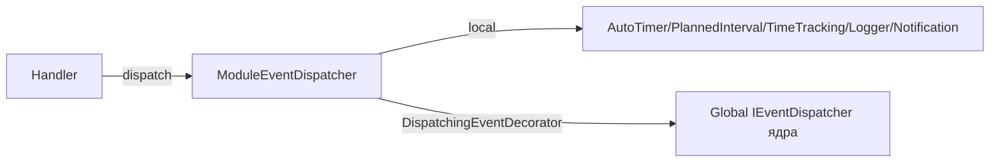

# Архитектура модуля tasks

> Документ описывает слои модуля, сущности и ключевые классы.

## 1. Структура

```
modules/tasks/
├── Module.php
├── application/
│   ├── assembler/       # TaskDtoAssembler, CommentDtoAssembler, StickerDtoAssembler,
│   │                    # TimeIntervalDtoAssembler, DailySummaryDtoAssembler, …
│   ├── command/         # CreateTask, UpdateTask, MoveTaskToColumn, AssignTask,
│   │                    # SoftDeleteTask, HardDeleteTask, RestoreTask,
│   │                    # StartTimer, StopTimer, LogManualInterval,
│   │                    # Create/Update/Delete/Reorder BoardColumn,
│   │                    # AddComment, UpdateComment, DeleteComment,
│   │                    # Create/Update/Delete Sticker, Attach/Detach Sticker
│   ├── dto/             # TaskDto, CommentDto, StickerDto, TimeIntervalDto,
│   │                    # DailySummaryDto, TaskTimeSummaryDto, BusySegmentDto,
│   │                    # TimeBlockDto, TaskPriorityDto, BoardColumnDto
│   ├── handler/         # ~40 хендлеров
│   ├── port/            # ITaskAccess
│   ├── query/           # GetTask, ListTasks, GetComments, ListStickers, …
│   └── service/         # BusyChartService, TaskStatisticsService
├── config/
│   ├── di.php           # репозитории, access, слушатели, шина событий, статистика
│   └── routing.php      # маршруты задач/колонок/комментариев/стикеров/таймеров
├── domain/
│   ├── entity/          # Task, BoardColumn, Comment, Sticker, TimeInterval,
│   │                    # DailySummary, TaskPriority
│   ├── event/           # TaskCreatedEvent, TaskUpdatedEvent, TaskAssignedEvent,
│   │                    # TaskMovedToColumnEvent, TaskSoftDeletedEvent, TaskRestoredEvent,
│   │                    # CommentAddedEvent, CommentUpdatedEvent,
│   │                    # StickerAttachedToTaskEvent,
│   │                    # TimerStartedEvent, TimerStoppedEvent, IntervalLoggedEvent
│   ├── repository/      # ITaskRepository, IBoardColumnRepository, ICommentRepository,
│   │                    # IStickerRepository, ITaskStickerRepository,
│   │                    # ITimeIntervalRepository, IDailySummaryRepository,
│   │                    # ITaskPriorityRepository
│   └── valueObject/     # TaskId, ColumnId, CommentId, StickerId, PriorityId,
│   │                    # TimeIntervalId, DailySummaryId, Title, Duration,
│   │                    # StickerName, StickerType, BoardId
├── infrastructure/
│   ├── access/          # TaskAccess
│   ├── event/           # ModuleEventDispatcher, DispatchingEventDecorator
│   ├── listener/        # AutoTimerListener, PlannedIntervalListener,
│   │                    # TimeTrackingListener, TaskLoggerListener,
│   │                    # TaskNotificationListener
│   ├── migrations/      # tasks, task_comments, task_time_intervals,
│   │                    # daily_time_summary, board_columns, stickers,
│   │                    # task_sticker_map, task_priorities, task_statuses
│   ├── persistence/     # TaskAR, BoardColumnAR, CommentAR, StickerAR,
│   │                    # TaskStickerMapAR, TimeIntervalAR, DailySummaryAR,
│   │                    # TaskPriorityAR
│   └── repository/      # Db*Repository (8 шт.)
└── presentation/
    ├── controller/      # TaskController, BoardColumnController, CommentController,
    │                    # StickerController, TaskStickerController,
    │                    # TimeIntervalController, PriorityController
    └── request/         # CreateTaskRequest, UpdateTaskRequest, MoveTaskRequest,
                         # StartTimerRequest, StopTimerRequest, …
```

## 2. Сущности предметной области

### 2.1. `Task`
Поля: `id`, `title: Title`, `description`, `columnId: ColumnId`, `priorityId: PriorityId`, `dueDate`, `plannedStart`, `plannedEnd`, `createdBy: UserId`, `assignedTo: ?UserId`, `boardId`, `parentId: ?TaskId`, `overdue`, `complete`, даты (`createdAt`, `updatedAt`, `deletedAt`).

Методы: `moveToColumn`, `assignTo`, `changeTitle/Description/DueDate/PlannedTime`, `markOverdue`, `markComplete`, `markAsDeleted`, `restore`, `setBoardId`, `setParentId`, `moveToBoard`.

Инварианты:
- `Title` — не пустое (см. VO).
- Мягкое удаление через `deletedAt`, восстановление через `restore()`.

### 2.2. `BoardColumn`
Поля: `id: ColumnId`, `boardId: BoardId`, `name` (системный slug), `label` (отображаемое), `sortOrder`, `isActive`, `isFinal`, `color`, `workflowId`, даты.

- `isActive` — «активная» колонка (влияет на автотаймер).
- `isFinal` — финальная колонка (останавливает таймер).
- Инварианты: `name` ≤ 50 символов, `label` ≤ 255.

### 2.3. `Comment`
Поля: `id`, `taskId`, `userId`, `content`, даты.

### 2.4. `Sticker`
Поля: `id`, `name: StickerName`, `type: StickerType`, `projectId?`, `data?`, `color?`, `createdBy: UserId`, даты.

Инвариант: для user-стикера обязателен `projectId`.

### 2.5. `TimeInterval`
Поля: `id`, `taskId`, `userId`, `startTime`, `endTime?`, `duration?`, `comment?`, `type: int` (TIMER=1/MANUAL=2/PLAN=3), даты.
Методы: `start()`, `stop(DateTimeImmutable, ?string $comment)`.

### 2.6. `DailySummary`
Поля: `id`, `taskId`, `userId`, `date: Date`, `totalDuration: Duration`, `updatedAt`.
Метод: `addTime(Duration)` — накопление.

### 2.7. `TaskPriority`
Поля: `id`, `value`, `label`, `color`.

## 3. Value objects

| VO | Описание |
|---|---|
| `TaskId`, `ColumnId`, `CommentId`, `StickerId`, `PriorityId`, `TimeIntervalId`, `DailySummaryId`, `BoardId` | ID (наследуют `AbstractIntId` ядра) |
| `Title` | Название задачи (не пустое, ограничение длины) |
| `Duration` | Длительность в секундах |
| `StickerName` | Имя стикера |
| `StickerType` | Тип стикера |

## 4. События и листенеры



Полная карта событие→листенеры — в [entities-events.md](./entities-events.md).

## 5. DI

`modules/tasks/config/di.php`:
- репозитории (8 шт.);
- `ITaskAccess` → `TaskAccess`;
- слушатели;
- `ModuleEventDispatcher` с картой событий;
- `DispatchingEventDecorator` с `$forwardEvents`;
- `ITaskStatisticsService` → `TaskStatisticsService` (реализует порт ядра).

Подробно — [configuration.md](./configuration.md).