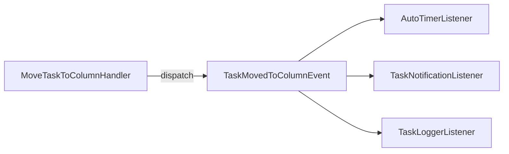

# Команды и запросы модуля tasks

> Полный справочник CQRS-команд и запросов модуля tasks.

## 1. Задачи

| Команда | Параметры | Описание / права |
|---|---|---|
| `CreateTaskCommand` | `title, columnId, priorityId, createdBy, boardId, description?, dueDate?, plannedStart?, plannedEnd?, assignedTo?, parentId?` | Создание задачи. Право: `canCreateTask` |
| `UpdateTaskCommand` | `id, updatedBy, + изменяемые поля` | Обновление. Право: `canUpdateTask` |
| `DeleteTaskCommand` (soft) | `id, deletedBy` | Мягкое удаление (`deletedAt`). Право: `canDeleteTask` |
| `HardDeleteTaskCommand` | `id, deletedBy` | Жёсткое удаление. Право: `canHardDeleteTask` |
| `RestoreTaskCommand` | `id, restoredBy` | Восстановление. Право: `canRestoreTask` |
| `AssignTaskCommand` | `taskId, assigneeId, assignedBy` | Назначение исполнителя. Право: `canAssignTask` |
| `MoveTaskToColumnCommand` | `id, columnId, movedBy` | Перенос в колонку. Право: `canMoveTaskToColumn` |

События, диспатчимые хендлерами:
- `TaskCreatedEvent` (Create)
- `TaskUpdatedEvent` (Update)
- `TaskSoftDeletedEvent` (soft delete)
- `TaskRestoredEvent` (restore)
- `TaskAssignedEvent` (assign)
- `TaskMovedToColumnEvent` (move)

## 2. Колонки (BoardColumn)

| Команда | Параметры | Право |
|---|---|---|
| `CreateBoardColumnCommand` | `boardId, name, label, sortOrder, createdBy, isActive?, isFinal?, color?, workflowId?` | `canCreateColumn` |
| `UpdateBoardColumnCommand` | `id, updatedBy, + поля` | `canUpdateColumn` |
| `DeleteBoardColumnCommand` | `id, deletedBy` | `canDeleteColumn` (пустая колонка) |
| `ReorderBoardColumnsCommand` | `boardId, orderedIds (int[]), updatedBy` | `canCreateColumn`/`canUpdateColumn` |

Запросы:
- `GetBoardColumnQuery` / `GetBoardColumnsQuery` — колонка / список колонок доски.
- Право просмотра: `canViewBoard` (через projectAccess).

## 3. Комментарии

| Команда | Параметры | Право |
|---|---|---|
| `AddCommentCommand` | `taskId, userId, content` | `canCommentOnTask` |
| `UpdateCommentCommand` | `id, userId, content` | автор комментария |
| `DeleteCommentCommand` | `id, userId` | автор комментария |

Запросы: `ListCommentsQuery`, `GetCommentQuery`.

События: `CommentAddedEvent`, `CommentUpdatedEvent` (слушает `TaskLoggerListener`).

## 4. Стикеры

| Команда | Параметры | Право |
|---|---|---|
| `CreateStickerCommand` | `name, type, createdBy, projectId?, data?, color?` | создатель |
| `UpdateStickerCommand` | `id, + поля` | создатель/админ |
| `DeleteStickerCommand` | `id` | создатель/админ |
| `AttachStickerToTaskCommand` | `taskId, stickerId` | `canAddStickerToTask` |
| `DetachStickerFromTaskCommand` | `taskId, stickerId` | `canAddStickerToTask` |

Запросы: `ListStickersQuery`, `GetStickerQuery`, `GetTaskStickersQuery`.

Событие: `StickerAttachedToTaskEvent` (логирование).

## 5. Тайм-трекинг

### 5.1. `StartTimerCommand` → `StartTimerHandler`
- Параметры: `taskId, userId, startTime? (default now), comment?`.
- Право: `canViewTask` (участник проекта).
- Создаёт `TimeInterval` с типом `timer`, `endTime = null` (активный).
- Диспатчит `TimerStartedEvent`.

### 5.2. `StopTimerCommand` → `StopTimerHandler`
- Параметры: `taskId, userId, endTime?, comment?`.
- Находит активный интервал таймера, вызывает `stop()` (вычисляет duration), сохраняет.
- Диспатчит `TimerStoppedEvent` → `TimeTrackingListener` обновляет daily summary.

### 5.3. `LogManualIntervalCommand` → `LogManualIntervalHandler`
- Параметры: `taskId, userId, startTime (обязательно), endTime (обязательно), comment?`.
- Создаёт интервал типа `manual`, считает duration.
- Диспатчит `IntervalLoggedEvent`.

### 5.4. Запросы
| Запрос | Параметры | Результат |
|---|---|---|
| `ListTimeIntervalsQuery` | `taskId, userId, from?, to?` | `TimeIntervalDto[]` |
| `GetTaskTimeSummaryQuery` | `taskId` | `TaskTimeSummaryDto` (blocks + total) |
| `GetDailySummaryQuery` | `userId, date` | `DailySummaryDto[]` |
| `GetUserBusyChartQuery` | `userId, from, to, granularity, mode` | `BusySegmentDto[]` |

## 6. Приоритеты

| Запрос | Описание |
|---|---|
| `ListPrioritiesQuery` | Список приоритетов (`TaskPriorityDto[]`) |

## 7. Фильтры ListTasksQuery

`ListTasksQuery(userId, filters)` поддерживает критерии (см. `toCriteria()`):

| Ключ фильтра | Тип | Критерий |
|---|---|---|
| `columnId` | int | по колонке |
| `assignedTo` | int | по исполнителю |
| `createdBy` | int | по создателю |
| `boardId` | int | по доске |
| `parentId` | int | по родителю |
| `onlyComplete` | bool | только завершённые |
| `onlyOverdue` | bool | только просроченные |
| `includeDeleted` | bool | включая удалённые |

> Пользователь может листать только задачи в проектах, где он участник (проверка `canViewTask` в хендлере).