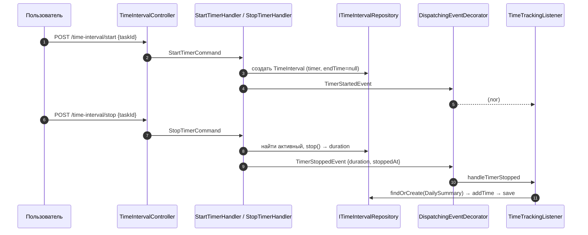

# Тайм-трекинг в модуле tasks

> Документ описывает учёт рабочего времени: таймеры, ручные интервалы, плановые интервалы, дневные сводки, сводку по задаче и диаграмму занятости.

## 1. Модель данных

### Таблица `task_time_intervals`

| Поле | Тип | Описание |
|---|---|---|
| `id` | bigint PK | |
| `task_id` | FK → tasks | Задача |
| `user_id` | bigint | Пользователь |
| `start_time` | datetime | Начало |
| `end_time` | datetime NULL | Конец (null = активный) |
| `duration` | int NULL | Длительность, сек |
| `comment` | string NULL | Комментарий |
| `type` | string | `timer` / `manual` / `plan` |
| `created_at` / `updated_at` | timestamp | |

### Типы интервалов (константы `TimeInterval`)

| Константа | Значение | Описание |
|---|---|---|
| `TYPE_TIMER` | `'timer'` | Автоматические/ручные таймеры |
| `TYPE_PLAN` | `'plan'` | Плановые интервалы (из planned-полей задачи) |
| (manual) | `'manual'` | Ручное логирование интервала |

### Таблица `task_daily_time_summary`

| Поле | Тип |
|---|---|
| `id`, `task_id`, `user_id` | int |
| `date` | date |
| `total_duration` | int (сек) |
| `updated_at` | timestamp |

## 2. Поток: таймер



## 3. Ручное логирование

`POST /time-interval` с `startTime` и `endTime`:

1. `LogManualIntervalHandler` создаёт интервал типа `manual` (или `timer`, см. реализацию).
2. Считает duration.
3. Диспатчит `IntervalLoggedEvent`.
4. (Уведомления/логи — через слушателей.)

## 4. Плановые интервалы

Задача имеет поля `plannedStart` / `plannedEnd`. `PlannedIntervalListener`:

- при создании задачи → создаёт интервал типа `plan` с этими временами;
- при обновлении planned-полей или исполнителя → обновляет планируемый интервал;
- если `plannedStart == null` → удаляет планируемый интервал.

> Плановые интервалы НЕ суммируются в статистику времени (они «планы», не факт).

## 5. Автотаймер (AutoTimerListener)

Запускается при событиях:

| Событие | Действие |
|---|---|
| `TaskMovedToColumnEvent` | переход в **active** колонку → создать таймер; выход из active → удалить; **финальная** колонка → остановить таймер |
| `TaskAssignedEvent` | смена исполнителя → перенести активный таймер на нового |
| `TaskSoftDeletedEvent` | остановить активный таймер |

> Примечание: при переходе active→non-active таймер **удаляется** (`remove`), а не останавливается. При финальной колонке — **останавливается** (`stop`).

## 6. Сводки

### 6.1. `GET /time-interval/daily-summary?date=...`

`GetDailySummaryHandler` → `DailySummaryDto[]` (по пользователю на дату).

### 6.2. `GET /task/{taskId}/time-summary`

`GetTaskTimeSummaryHandler` → `TaskTimeSummaryDto`:
- `taskId`, `taskTitle`;
- `blocks: TimeBlockDto[]` (start, end, type, taskIds, duration);
- `totalDuration` (сек).

### 6.3. `GET /time-interval` (список)

`ListTimeIntervalsHandler` → `TimeIntervalDto[]` с фильтрами `taskId`, `userId`.

## 7. Диаграмма занятости (BusyChartService)

`GET /user/busy-chart?from=&to=&granularity=&mode=` (или аналогичный маршрут) → `BusySegmentDto[]`.

### Логика `BusyChartService::build(intervals, granularity, mode)`

1. **Округление** (`roundIntervals`): start → floor, end → ceil по гранулярности:
   - `minute` — до минут;
   - `ten_minutes` — до 10 минут;
   - `hour` — до часа (end → +1 час).
2. **Режим** (`mode`):
   - `merged` — объединить пересекающиеся/смежные интервалы (taskIds = уникальные);
   - `separate` — каждый интервал отдельным сегментом;
   - `overlap` — найти пересечения (событийная модель «start/end»), каждый сегмент с набором активных taskId.

### Формат `BusySegmentDto`

```json
{
  "start": "2026-03-30 09:00:00",
  "end": "2026-03-30 09:50:00",
  "taskIds": [100, 101],
  "anchorPoints": []
}
```

> `granularity` и `mode` поддерживают значения из `GetUserBusyChartQuery` (default: `minute` / `merged`). Неверный `mode` → `InvalidArgumentException`.

## 8. Резюме: где что хранится

| Данные | Таблица | Управляется |
|---|---|---|
| Таймеры и ручные интервалы | `task_time_intervals` (type=timer/manual) | StartTimer/StopTimer/LogManualInterval |
| Плановое время | `task_time_intervals` (type=plan) | PlannedIntervalListener |
| Дневная сводка | `task_daily_time_summary` | TimeTrackingListener |
| Диаграмма занятости | расчёт из `task_time_intervals` | BusyChartService |